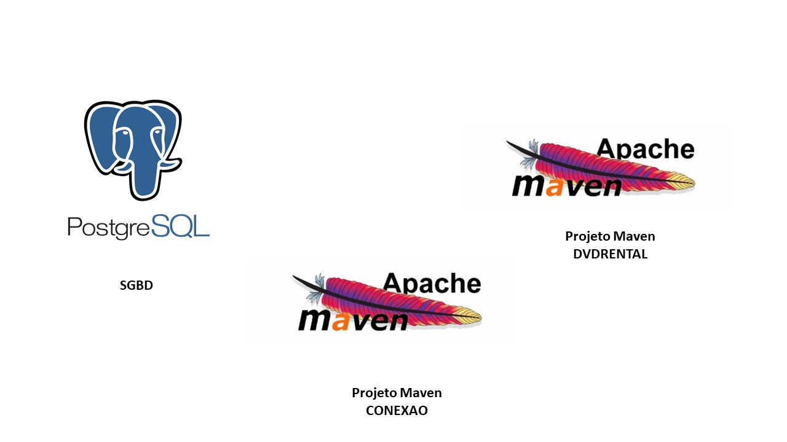
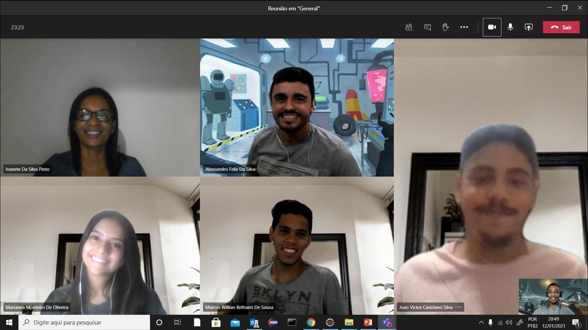

# Projeto - API - DVD RENTAL

## Objetivos

* Usar amostra de banco de [PostgreSQL Sample Database](https://www.postgresqltutorial.com/postgresql-sample-database/), que promove estrutura e entidades fortes, fracas e de relacionamentos.

* Desenvolver CRUD em Java para Customers e Films, envolvendo o que for necessário, como deleção de entidades de relecionamentos.

* Utilizar JPA para implantar a solução.

## Requisitos

### Softwares

* Eclipse
* PostgreSQL

### Conhecimentos
* Java
* JPA
* Maven
* SQL Statments

## Proposta de Solução

### Separação da solução

Nossa proposta de solução consiste em `3 partes`:

1. **``SGBD``**: Interface gerenciadora da amostra de Banco de Dados.
2. **``Projeto Maven (conexao)``**: Projeto cujo objetivo é ser genérico e também poder ser utilizado em outros projetos.
3. **``Projeto Maven (dvdrental)``**: Projeto com a solução implementada.

### Estrutura - 3º projeto

**OBS**: A `1ª e 2ª parte`são projetos pequenos e de fácil entendimento. Não necessitando maior explanação.

O `3º projeto` sim requer maiores detalhes.

O projeto está dividido em 6 pacotes, onde os 3 primeiros a seguir são da implementação em si, e os 3 últimos simular interação com usuário/aplicação.

1. `com.qintess.dvdrental`
    * Com o App.java, onde inicializamos a aplicação.
2. `com.qintess.dvdrental.dao`
    * Arquivo (_CheckExistsDAO) para checar existência de entidades no BD.
    * Implementações DAO das entidades.
3. `com.qintess.dvdrental.entidades`
    * Implementações das entidades.
    * Manipulação via construtores para construir/instaciar novos projetos.
4. `com.qintess.dvdrental.erro`
    * Tratativa de erros com entratadas erradas por parte da aplicação/usuário.
5. `com.qintess.dvdrental.menu`
    * Implementação de um projeto "genérico" (CallScanner.java) para facilitar as solicitações de inputs.
    * Opções de atividades implementadas a disposição para o usuário/aplicação.
6. `com.qintess.dvdrental.menu.executaveluser`
    * Métodos executaveis com o objetivo de fazer as chamadas e/ou informar a camada DAO para alguma requisição ao Banco de Dados.

## Densenvolvimento das Atividasdes

* Durante toda a semana investimos mais do que o tempo para estágio para completar esse projeto, não porque nos foi solicitado, mas porque queríamos desenvolver o máximo possível.

* Então ao iniciar e perto do horário de fechar a grade do estágio nos reunimos e promovíamos os PITCHS com apresentação de solução desenvolvida até o momento.

* Perto do 3/5 dia para entrega do projeto, houve a mudança do formato, com um integrante centralizando e unificando o código desenvolvido por cada parte.

### Lições Aprendidas

#### `Pontos que funcionaram na equipe`:
* Reuniões diárias, tanto para iniciar quanto para finalizar o dia (PITCH).
* Comunicação em geral.
* Divisão das partes do desafio.
* Ajudar os colegas que precisavam de suporte.
* Compartilhamento de aprendizado.
* Sincronia na forma de pensar.

#### `Pontos que NÃO funcionaram na equipe`:

* Copiar código de um computador para o outro, nos gerou: 
* Perca de código.
* Estresse.
* Funcionalidades perdidas.

#### `Pontos a desenvolver no próximo projeto`:
* Conhecer estruturas de projetos.
* Estudar a arquitetura do projeto antes.

## Equipe

## Parabéns Equipe

Conhecimento sem uso é em vão. E nesse projeto, foi possível usar muito do que estamos aprendendo com nosso instrutor [Gustavo](https://br.linkedin.com/in/gustavo-martins-marinelli-0845a2123).

Gratidão por ser uma equipe fantástica.